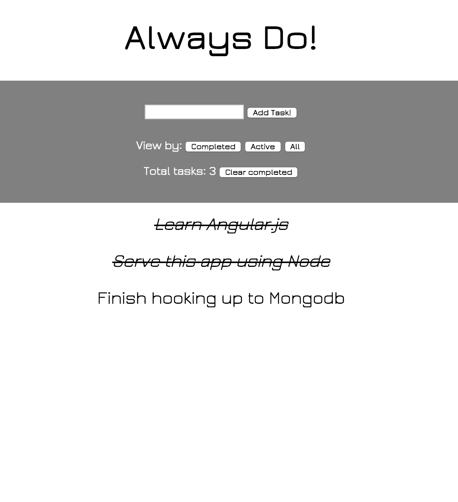

[](https://travis-ci.org/DanBlakeman/todo_challenge)
[](https://coveralls.io/r/DanBlakeman/todo_challenge)

# Always Do!

A fun instantly updating single page application to-do list app made using Angular.js & Node!

Made in one weekend at Makers Academy.

Screenshot
-------



How to use?
-------

Simply visit: http://boiling-sierra-2999.herokuapp.com/index.html or download and run 'npm start' in root.

Enter your to-do list items, and click to clear once you've completed them!

Click buttons to filter by, or clear completed items.

How to run tests?
-------

As this was an experiment with new JS technologies there's a number of different tests which can be run:

As setup, please run 'webdriver-manager start' and 'http-server' to allow the test suites headless browsers to work correctly.

You can then run 'karma start test/unit/karma.conf.js' to run the unit tests.

protractor test/e2e/conf.js to run feature tests of the application.

Or you can run the work in progress tests on the backend server, by running 'npm start', then typing 'grunt'.

How to contribute?
-------

All feedback most welcome, simply comment, email, or send pull request!


User Stories
-------

```
As a forgetful person
I want to store my tasks
So that I don't forget them

As a person with limited time
I want to instantly be able to update my todo list (adding and changing entries)
So that I have more time to think about other things

As a person who actually gets stuff done
I want to mark my tasks as done
So that I don't do them twice

As a person with a lot of tasks
I want to be able to filter my tasks by "All", "Active", "Complete"
So that I only see the relevant tasks

As a person who doesn't like counting by hand
I want to see a total number of tasks
So that I don't have to count

As someone who has done lots of stuff
I want to be able to clear my completed tasks
So I never see them again
```

## Extensions

Below is some ideas i'd like to continue with to further this app:

* Continue with work in progress persistance layer using Node to serve an api which updates a MongoDB/Mongoose db.

* Make more mobile friendly with Bootstrap or Foundation.

* Implemetning test suites with CI.

* Further automation of tests with grunt.

* Refactor angular controllers further.


As ever, thanks for reading!

